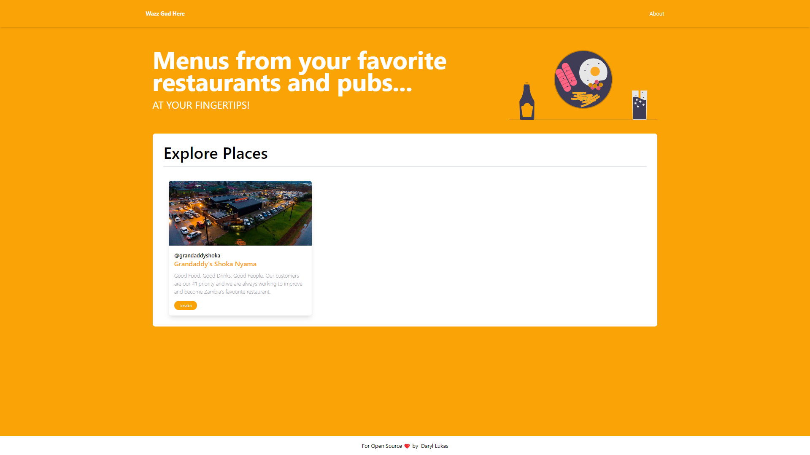

# Wazz Gud Here - Strapi x Next.js x Tailwind CSS Portfolio Project

This repository contains the following:

- Strapi project with existing Content-types and data (`/backend`)
- Next.js client ready to fetch the content of the Strapi application (`/frontend`)

## Preview


## Local Development
### 1. Clone Repo

- Clone the repository by running the following command:

```bash
git clone https://github.com/daryllukas/wazz-gud-here.git
```

- Navigate to your project folder by running `cd wazz-gud-here`.

### 2. Environment Variables

Be sure to have the correct env variables for each part:

- Next.js (example in `./frontend/.env.local`):
  - `NEXT_PUBLIC_STRAPI_API_BASE=<url-of-strapi>`
  - `NEXT_PUBLIC_STRAPI_API_TOKEN=<random-token>`


## 3. Start Strapi

Navigate to the `backend` folder by running `cd backend` from your command line.

- Run the following command in the `backend` folder:

```bash
npm i & npm run develop
```

This will install the dependencies, fill your application with data and run your server. You can run these commands separately.

## 4. Start Next.js

Navigate to the `frontend` folder by running `cd client` from your command line.

- Run the following command in the `frontend` folder

```bash
npm i && npm run dev
```